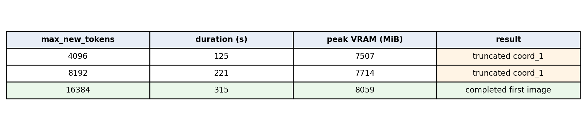
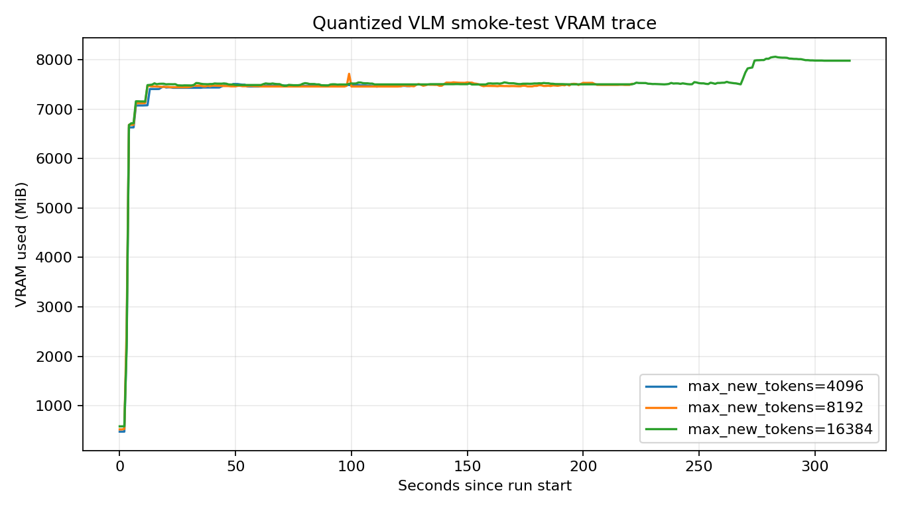

# Quantized VLM smoke test — 2026-04-14

This experiment validates whether the PhysX-Anything VLM stage can run on the local RTX 4080 SUPER 16GB GPU using bitsandbytes 4-bit quantization. Raw CSV traces are intentionally **not** committed; report-ready Matplotlib images are attached below.

## Configuration

Use the checked-in YAML only as a quantization/model-loading preset; keep runtime choices on the CLI:

```bash
conda run -n physx-anything python 1_vlm_demo.py \
  --quant_config configs/inference/vlm_4bit_quantization.yaml \
  --demo_path ./demo \
  --output_path ./test_demo \
  --limit 1 \
  --max_new_tokens 16384 \
  --save_part_ply False
```

The YAML preset owns only these settings:

| Setting | Value |
| --- | --- |
| quantization | `4bit` |
| attention | `sdpa` |
| dtype | `bfloat16` |
| bitsandbytes quant type | `nf4` |
| bitsandbytes double quant | `true` |

Runtime settings such as image path, output path, limits, and generation token cap remain CLI/default parameters.

## Matplotlib summary table



## Matplotlib VRAM trace



## Observations

| max_new_tokens | Peak VRAM (MiB) | Result |
| --- | ---: | --- |
| `4096` | `7507` | Completed process but truncated `coord_1.txt` |
| `8192` | `7714` | Completed process but truncated `coord_1.txt` |
| `16384` | `8059` | Completed first image and produced `allind.npy` |

Output from the successful `16384` run:

| File | Notes |
| --- | --- |
| `basic_info.txt` | VLM structural/material description |
| `coord_0.txt`, `coord_1.txt` | Voxel coordinate text for two detected parts |
| `ind_0.npy`, `ind_1.npy` | Decoded voxel arrays |
| `allind.npy` | Concatenated voxel array for decoder input |

Array summary from the successful run:

| File | Shape | Bounds |
| --- | --- | --- |
| `ind_0.npy` | `(324, 3)` | min `[13, 0, 18]`, max `[18, 19, 24]` |
| `ind_1.npy` | `(2520, 3)` | min `[1, 2, 1]`, max `[31, 31, 22]` |
| `allind.npy` | `(2844, 3)` | min `[1, 0, 1]`, max `[31, 31, 24]` |

## Why no CSV in git

The CSV files were useful while debugging locally, but they are raw experiment telemetry. For the PR, the repo keeps the durable report artifact instead: Markdown + Matplotlib-generated images. If a later report needs fresh plots, regenerate from a local run rather than storing raw traces in the repo.

## Decoder blocker

The VLM stage is verified. Decoder work is separate and currently blocked on `kaolin`; see [decoder_import_blockers.md](decoder_import_blockers.md) in this directory.
